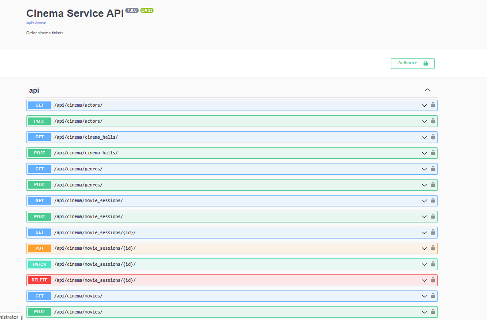
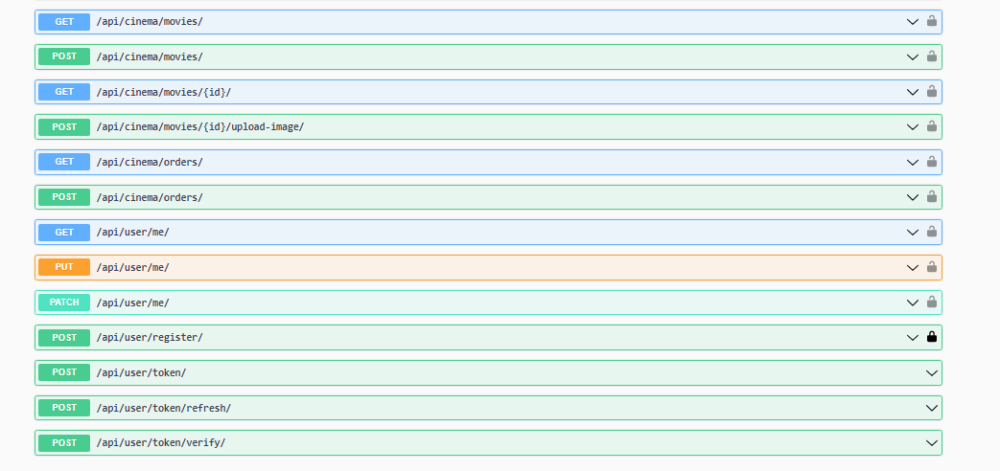
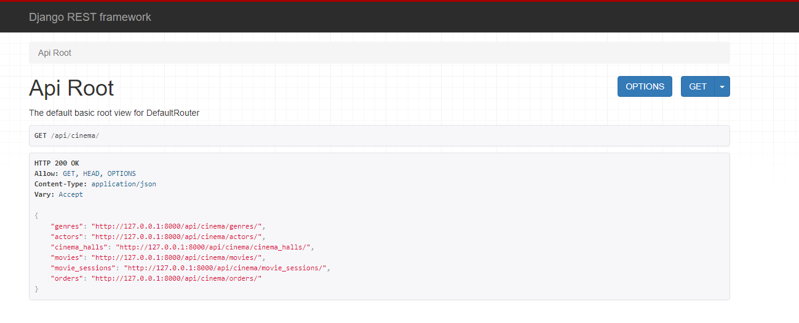
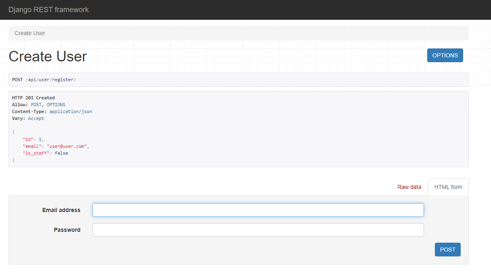

# API Cinema Service
 
API on Django REST Framework for ordering tickets, managing users, movies, cinema sessions, etc.

## Check it out!

### DOCKER
This project pushed on the Docker Hub, so you can just pull it from there.

Pull this project from Docker Hub, for this you need to be registered there, then use these commands:
```shell
-docker pull serhii1leonenko/api-cinema-service`
-docker compose up app
```
After that use you browser for local connection to the API.

### GitHub

```shell
git clone https://github.com/Serhii-Leonenko/api-cinema-service
cd api-cinem-service
python3 -m venv venv
source venv/bin/activate
pip install -r requirements.txt
python manage.py migrate
python manage.py runserver
```

Use API documentation to have understanding about all available endpoints: \
`http://127.0.0.1:8000/api/doc/swagger/` \
or \
`http://127.0.0.1:8000/api/doc/redoc/`


## Features

* Registration by email.
* Authentication by JWT with different permissions also Throttling.
* Managing genres, actors, movies, halls, cinema-sessions, orders with tickets.
* Powerful admin panel for advanced managing.

## Demo




